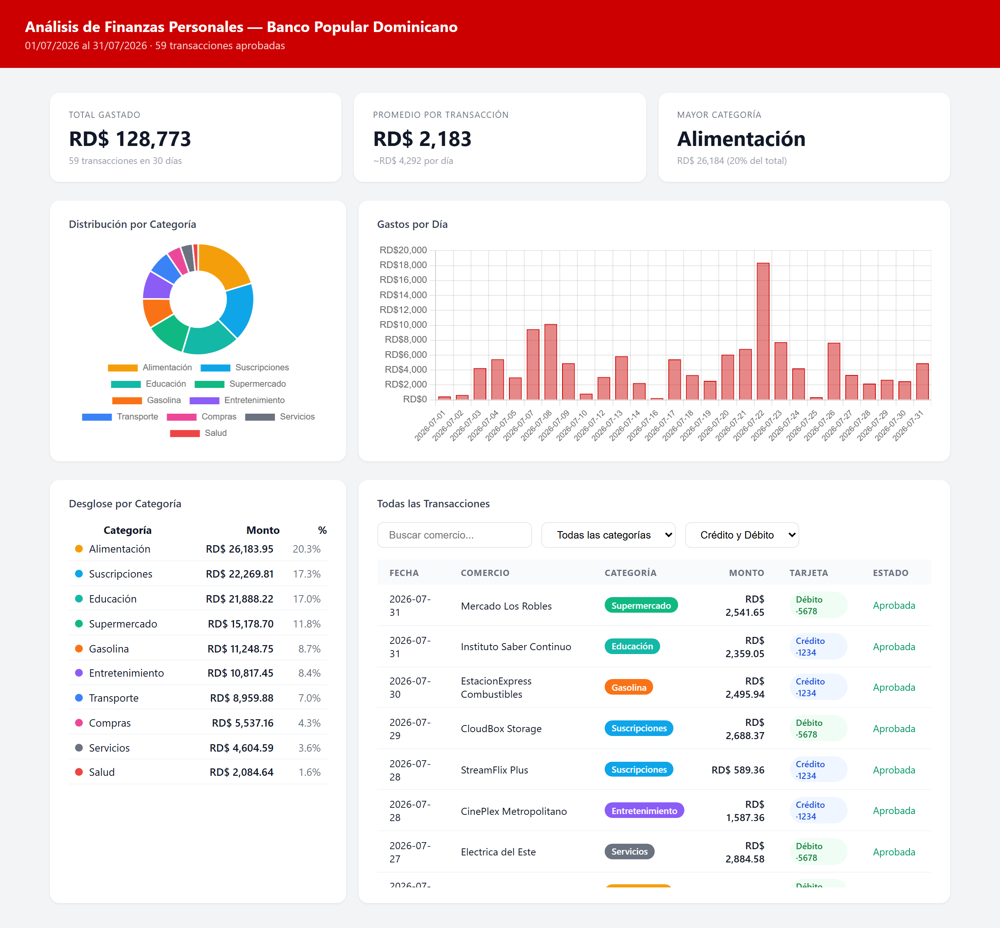
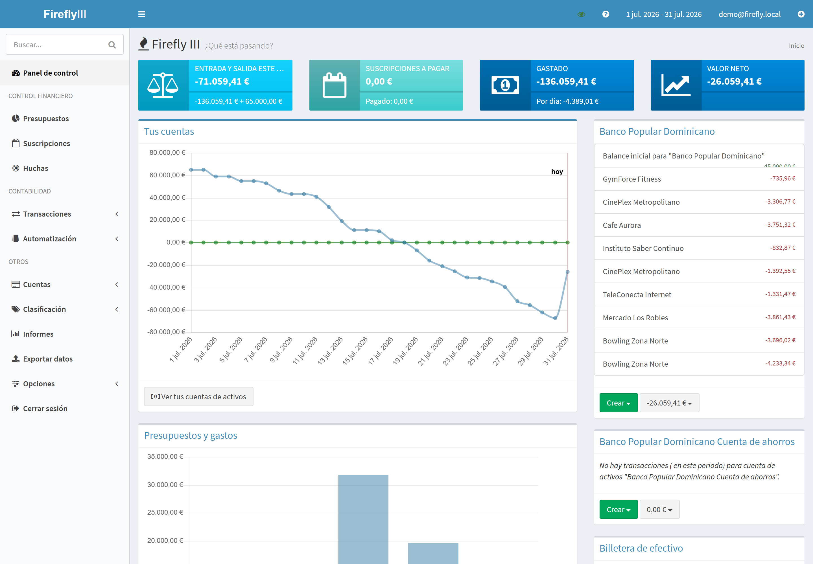
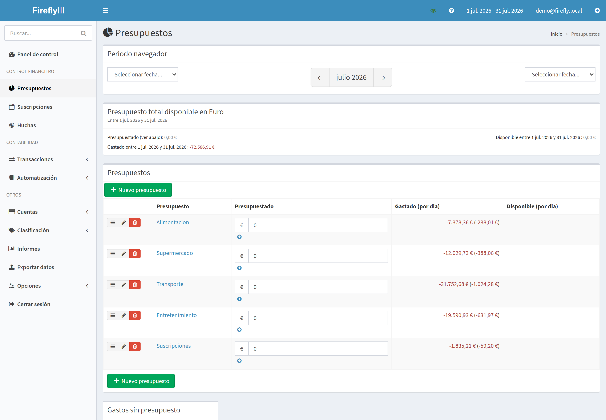
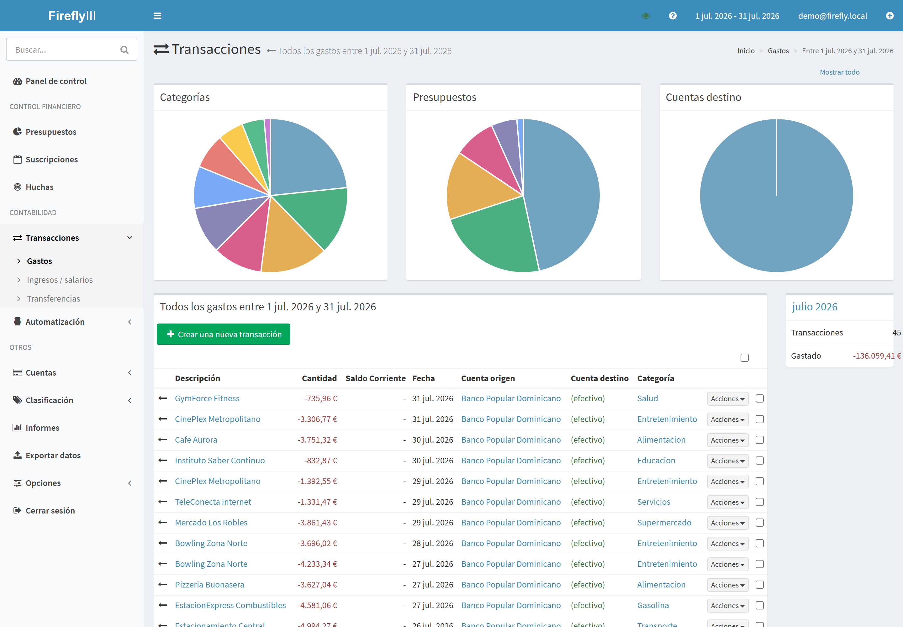

# Automatizacion de Finanzas Personales (Gmail -> categorizacion con LLM -> Firefly III)

*Version original - [traduccion al ingles](README.md)*

Un pipeline de extremo a extremo que convierte correos de notificacion bancaria
en un presupuesto categorizado y autohospedado, sin captura manual de datos.

## Arquitectura

```
Correo de notificacion bancaria (Gmail)
        |
        v
finanzas_bpd.py  --  parsea el correo, extrae comercio/monto/fecha
        |
        +--> reglas de keywords (instantaneo, gratis)      ~70% de las transacciones
        +--> Claude Haiku (por lotes, solo para el resto)
        +--> enriquecimiento opcional con Google Places (fallback para comercios ambiguos)
        |
        v
Dashboard HTML interactivo (Chart.js) -- generado localmente, abre en el navegador
        |
        v
firefly-iii/sync_all.py  --  sube las transacciones categorizadas a una
        |                     instancia autohospedada de Firefly III via su API REST
        v
Firefly III (Docker: app + MariaDB + cron)  --  presupuestos, sobres, reportes
```

Un Atajo de iOS anade una segunda senal: en cada tap NFC de Apple Pay, se
manda un correo con el nombre limpio del comercio (el que muestra Wallet, no
el descriptor sucio del banco). El script cruza ese correo con la
notificacion bancaria por monto y fecha (+-1 dia) y sustituye el nombre.

## Por que este diseno

- **Categorizacion por capas, lo mas barato primero.** Las reglas de keywords
  resuelven la mayoria de los comercios gratis e instantaneamente; solo los
  ambiguos van a un LLM, por lotes para controlar el costo. Es el mismo
  patron de "filtro barato antes del modelo caro" que se usa en pipelines de
  ML en produccion.
- **Idempotente por construccion.** Tanto el cache de correo-a-transaccion
  como la sincronizacion con Firefly rastrean IDs procesados, asi que volver
  a correr el pipeline nunca duplica datos.
- **Sin contabilidad manual.** El punto central es que una transaccion no
  requiere ningun toque despues de la configuracion inicial -el correo de
  notificacion es la unica entrada.

## Demo

No necesita credenciales para ver el resultado: `python demo/generar_dashboard_demo.py`
genera `demo/dashboard_demo.html` a partir de 60 transacciones sinteticas
(comercios ficticios, sin datos de gasto reales) usando la misma funcion
`generate_dashboard()` del pipeline en produccion.


*Desglose por categoria, gasto diario y una tabla de transacciones buscable -
todo generado a partir de datos ficticios por `demo/generar_dashboard_demo.py`.*

### Firefly III en si

Las capturas de arriba son del dashboard propio de `finanzas_bpd.py`. Lo que
realmente sostiene el presupuesto a largo plazo es
[Firefly III](https://www.firefly-iii.org/), la herramienta autohospedada a
la que este pipeline empuja las transacciones ya categorizadas (ver
Arquitectura arriba). Estas capturas son de una instancia local desechable
poblada con el mismo tipo de datos ficticios - no el presupuesto real del
autor.


*Tendencia de valor neto y balances de cuenta a lo largo de un mes, generado
enteramente con transacciones sinteticas empujadas via la API de Firefly III.*


*Seguimiento de gasto por presupuesto - una de las vistas que `sync_all.py`
mantiene al dia sin ninguna captura manual.*


*La lista de transacciones que arma Firefly III a partir de lo que empuja
`finanzas_bpd.py`: categoria y presupuesto ya asignados, buscable y filtrable.*

## Configuracion

1. `pip install -r requirements.txt`
2. Google Cloud Console: habilitar la Gmail API, crear credenciales OAuth2
   (tipo "Aplicacion de escritorio"), descargar como `client_secret.json` en
   esta carpeta.
3. Copiar `config.example.json` a `config.json` y llenar tus propios valores
   (la API key de Google Places es opcional, solo se usa para enriquecer
   comercios sin categorizar).
4. Configurar `ANTHROPIC_API_KEY` en tu entorno.
5. `python finanzas_bpd.py --desde 2026-01-01 --hasta 2026-01-31`

### Firefly III (opcional, para seguimiento de presupuesto)

`firefly-iii/` contiene un `docker-compose.yml` (Firefly III + MariaDB + un
contenedor cron para tareas recurrentes) y los scripts de sincronizacion.

1. Copiar `.env.example` -> `.env` y `.db.env.example` -> `.db.env`,
   llenando tu propio `APP_KEY`, `STATIC_CRON_TOKEN` (ambos cualquier string
   aleatorio de 32 caracteres) y una contrasena de base de datos (debe
   coincidir en ambos archivos).
2. `docker compose up -d`
3. En la interfaz web de Firefly III (`http://localhost:8080`), crear un
   token de acceso personal, luego copiar `token.env.example` -> `token.env`
   con tu `FIREFLY_URL` y `FIREFLY_TOKEN`.
4. Correr `setup_firefly.py` una vez para crear tus categorias/presupuestos
   (editar `PRESUPUESTOS` primero con tu propia estructura de presupuesto),
   luego `sync_all.py` para subir transacciones.

## Archivos

- `finanzas_bpd.py` - el pipeline principal: parseo de Gmail, categorizacion
  (keywords + Claude), cruce con Apple Pay, generacion del dashboard HTML.
- `firefly-iii/docker-compose.yml` - stack autohospedado de Firefly III.
- `firefly-iii/sync_all.py` - la sincronizacion diaria principal: lee Gmail
  via IMAP, clasifica cuatro tipos de notificacion (consumo, retiro de
  cajero, transferencia instantanea, deposito de nomina), y las sube a
  Firefly. Incluye un estimador auto-corregible del monto de nomina (el
  correo del banco nunca trae la cifra, asi que reutiliza la ultima
  confirmada en Firefly).
- `firefly-iii/sync_firefly.py` - una sincronizacion mas simple y de un solo
  proposito (un archivo JSON de transacciones -> Firefly), util como
  referencia mas pequena que `sync_all.py`.
- `firefly-iii/setup_firefly.py` - script de un solo uso para crear
  categorias/sobres de presupuesto (editar `PRESUPUESTOS` con tu propia
  estructura).
- `firefly-iii/run_sync.ps1`, `abrir_presupuesto.ps1` - ayudantes de Windows
  para correr la sincronizacion como tarea programada y abrir el dashboard.

## Habilidades demostradas

Parseo de correo a escala, uso de LLM por capas consciente del costo, diseno
de pipeline idempotente, integracion con APIs REST (Gmail, Anthropic, Google
Places, Firefly III), y autohospedaje de una herramienta de presupuesto con
Docker.

---

[getuliodeleon.com](https://getuliodeleon.com/es/) | [LinkedIn](https://www.linkedin.com/in/getuliodeleon/) | [GitHub](https://github.com/deleongetulio)
